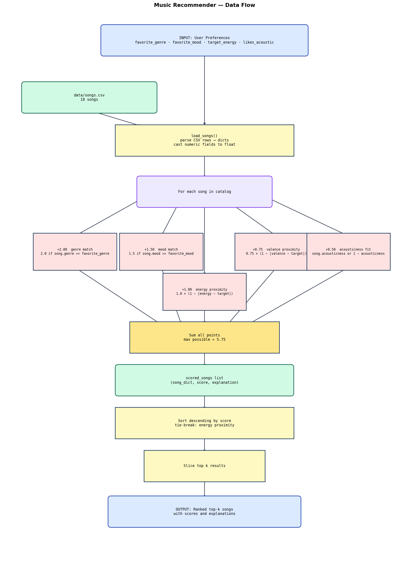
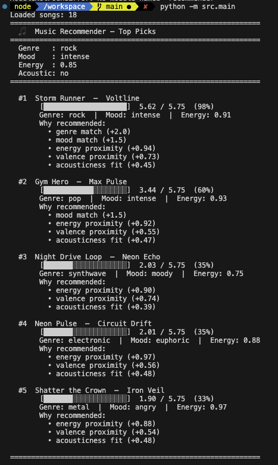
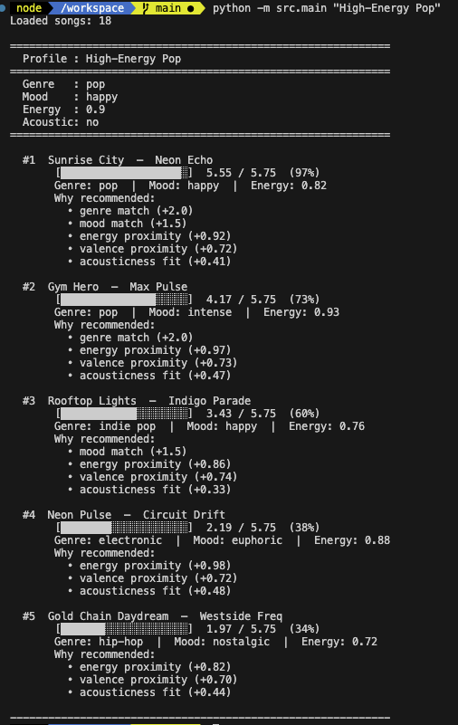
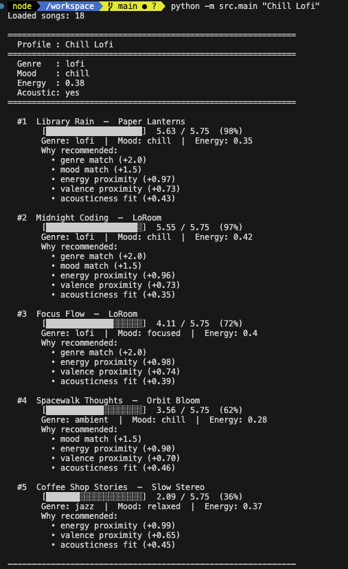
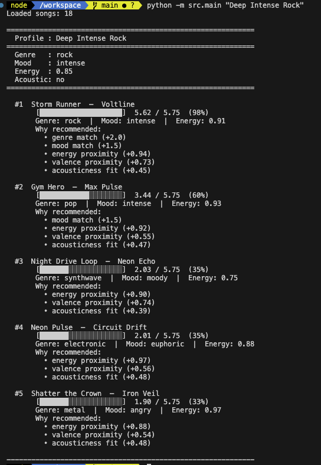

# 🎵 Music Recommender Simulation

## Project Summary

In this project you will build and explain a small music recommender system.

Your goal is to:

- Represent songs and a user "taste profile" as data
- Design a scoring rule that turns that data into recommendations
- Evaluate what your system gets right and wrong
- Reflect on how this mirrors real world AI recommenders

Replace this paragraph with your own summary of what your version does.

---

## How The System Works

Real-world recommenders like Spotify or YouTube learn from millions of listening events to predict what a user will enjoy next. They combine collaborative filtering (what similar users liked) with content-based signals (the properties of the song itself). This simulation focuses purely on the content-based side: it compares the attributes of each song against a user's stated preferences and assigns a score. The system prioritizes **mood and genre matching** as the strongest signals of musical taste, then uses **energy proximity** to fine-tune results — rewarding songs whose energy level is close to what the user wants rather than simply the highest or lowest. Valence (musical positiveness) and acousticness round out the score to distinguish songs that might share a genre and energy level but feel emotionally different.

### Song Features Used

| Feature        | Type        | Role in scoring                              |
| -------------- | ----------- | -------------------------------------------- |
| `genre`        | categorical | Hard preference match                        |
| `mood`         | categorical | Hard preference match                        |
| `energy`       | float 0–1   | Proximity to user's target energy            |
| `valence`      | float 0–1   | Proximity to user's preferred positiveness   |
| `acousticness` | float 0–1   | Rewards acoustic or electronic preference    |
| `tempo_bpm`    | integer     | Secondary tiebreaker (normalized)            |
| `danceability` | float 0–1   | Available on `Song`; not weighted by default |

### UserProfile Fields

| Field            | Type      | Used for                              |
| ---------------- | --------- | ------------------------------------- |
| `favorite_genre` | string    | Genre match signal                    |
| `favorite_mood`  | string    | Mood match signal                     |
| `target_energy`  | float 0–1 | Energy proximity scoring              |
| `likes_acoustic` | bool      | Acousticness direction (high vs. low) |

### Algorithm Recipe (Finalized)

Each song is scored against the user profile using this point system:

| Rule              | Max Points | Formula                                            |
| ----------------- | ---------- | -------------------------------------------------- |
| Genre exact match | +2.00      | `2.0 if song.genre == favorite_genre`              |
| Mood exact match  | +1.50      | `1.5 if song.mood == favorite_mood`                |
| Energy proximity  | +1.00      | `1.0 × (1 − \|song.energy − target_energy\|)`      |
| Valence proximity | +0.75      | `0.75 × (1 − \|song.valence − target_valence\|)`   |
| Acousticness fit  | +0.50      | `0.5 × acousticness` or `0.5 × (1 − acousticness)` |
| **Max total**     | **5.75**   |                                                    |

Songs are then **ranked in descending score order**. Ties are broken by energy proximity (closer wins). The top `k` are returned with a plain-language explanation.

### Expected Biases and Limitations

- **Genre over-prioritization.** Genre carries 2.0 of 5.75 points (35%). A great song in a related genre (e.g. metal for a rock listener) scores 0 for genre and will rank below a mediocre exact-genre match. The system may filter out genuinely good fits that cross genre boundaries.
- **Mood rigidity.** Mood adds another 1.5 points, meaning genre + mood together account for 61% of the maximum score. Any song that misses both will be buried regardless of how well its audio features match — even if it would sound right to a human listener.
- **Catalog skew.** With only 18 songs, some genres have a single representative. A folk fan will always see the same song at the top; there is no diversity within the match.
- **No listening history.** The system has no memory. It recommends the same songs every time for the same profile, with no novelty or discovery.
- **Binary acousticness.** `likes_acoustic` is true/false. A user who likes "a little acoustic texture" gets the same weight as one who exclusively listens to unplugged recordings.

### Data Flow Diagram



```mermaid
flowchart TD
    A([User Preferences\nfavorite_genre · favorite_mood\ntarget_energy · likes_acoustic]) --> C

    B[(data/songs.csv\n18 songs)] --> C

    C[load_songs\nparse CSV rows into dicts\ncast numeric fields to float]

    C --> D{For each song\nin catalog}

    D --> E1[+2.0 if genre matches\nfavorite_genre]
    D --> E2[+1.5 if mood matches\nfavorite_mood]
    D --> E3[+1.0 × energy proximity\n1 − |song.energy − target_energy|]
    D --> E4[+0.75 × valence proximity\n1 − |song.valence − target_valence|]
    D --> E5[+0.5 × acousticness fit\nsong.acousticness or 1 − acousticness]

    E1 & E2 & E3 & E4 & E5 --> F[Sum all points\nmax possible = 5.75]

    F --> G[(scored_songs list\nsong · score · explanation)]

    G --> H[Sort descending by score\ntie-break by energy proximity]

    H --> I[Slice top k results]

    I --> J([Output\nRanked top-k songs\nwith scores and explanations])
```

---

## Screenshots









## Getting Started

### Setup

1. Create a virtual environment (optional but recommended):

   ```bash
   python -m venv .venv
   source .venv/bin/activate      # Mac or Linux
   .venv\Scripts\activate         # Windows

   ```

2. Install dependencies

```bash
pip install -r requirements.txt
```

3. Run the app:

```bash
python -m src.main
```

### Running Tests

Run the starter tests with:

```bash
pytest
```

You can add more tests in `tests/test_recommender.py`.

---

## Experiments You Tried

Use this section to document the experiments you ran. For example:

- What happened when you changed the weight on genre from 2.0 to 0.5
- What happened when you added tempo or valence to the score
- How did your system behave for different types of users

---

## Limitations and Risks

Summarize some limitations of your recommender.

Examples:

- It only works on a tiny catalog
- It does not understand lyrics or language
- It might over favor one genre or mood

You will go deeper on this in your model card.

---

## Reflection

Read and complete `model_card.md`:

[**Model Card**](model_card.md)

Write 1 to 2 paragraphs here about what you learned:

- about how recommenders turn data into predictions
- about where bias or unfairness could show up in systems like this

---

## 7. `model_card_template.md`

Combines reflection and model card framing from the Module 3 guidance. :contentReference[oaicite:2]{index=2}

```markdown
# 🎧 Model Card - Music Recommender Simulation

## 1. Model Name

Give your recommender a name, for example:

> VibeFinder 1.0

---

## 2. Intended Use

- What is this system trying to do
- Who is it for

Example:

> This model suggests 3 to 5 songs from a small catalog based on a user's preferred genre, mood, and energy level. It is for classroom exploration only, not for real users.

---

## 3. How It Works (Short Explanation)

Describe your scoring logic in plain language.

- What features of each song does it consider
- What information about the user does it use
- How does it turn those into a number

Try to avoid code in this section, treat it like an explanation to a non programmer.

---

## 4. Data

Describe your dataset.

- How many songs are in `data/songs.csv`
- Did you add or remove any songs
- What kinds of genres or moods are represented
- Whose taste does this data mostly reflect

---

## 5. Strengths

Where does your recommender work well

You can think about:

- Situations where the top results "felt right"
- Particular user profiles it served well
- Simplicity or transparency benefits

---

## 6. Limitations and Bias

Where does your recommender struggle

Some prompts:

- Does it ignore some genres or moods
- Does it treat all users as if they have the same taste shape
- Is it biased toward high energy or one genre by default
- How could this be unfair if used in a real product

---

## 7. Evaluation

How did you check your system

Examples:

- You tried multiple user profiles and wrote down whether the results matched your expectations
- You compared your simulation to what a real app like Spotify or YouTube tends to recommend
- You wrote tests for your scoring logic

You do not need a numeric metric, but if you used one, explain what it measures.

---

## 8. Future Work

If you had more time, how would you improve this recommender

Examples:

- Add support for multiple users and "group vibe" recommendations
- Balance diversity of songs instead of always picking the closest match
- Use more features, like tempo ranges or lyric themes

---

## 9. Personal Reflection

A few sentences about what you learned:

- What surprised you about how your system behaved
- How did building this change how you think about real music recommenders
- Where do you think human judgment still matters, even if the model seems "smart"
```
